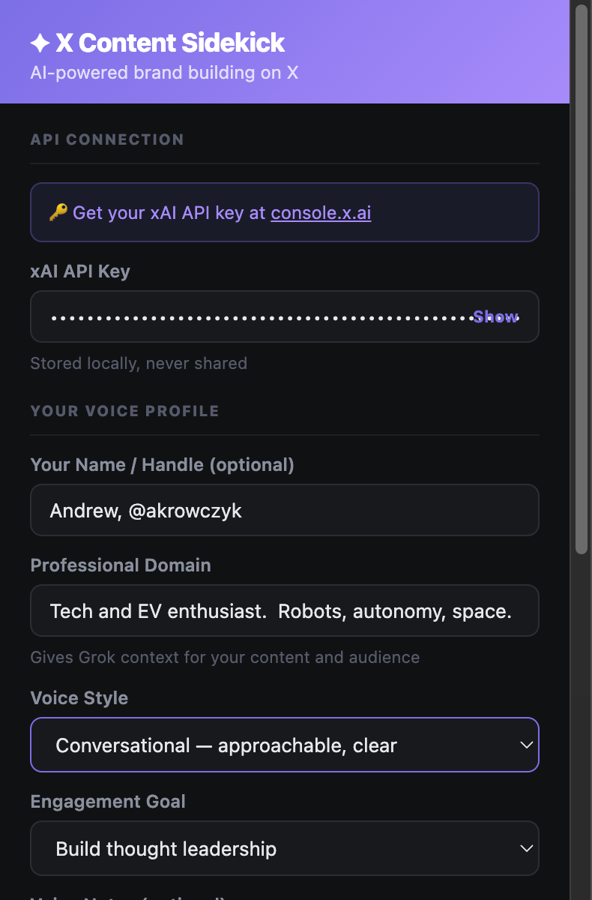
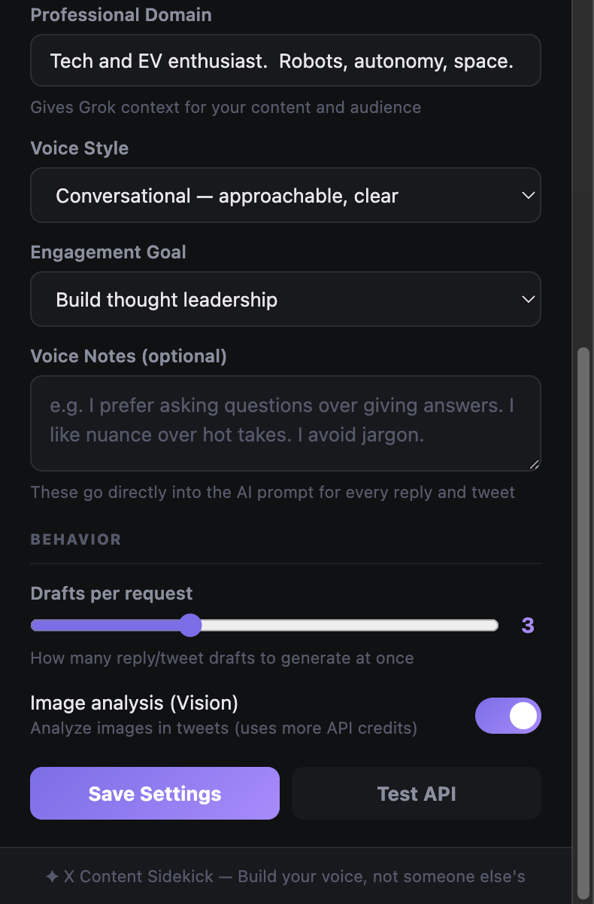
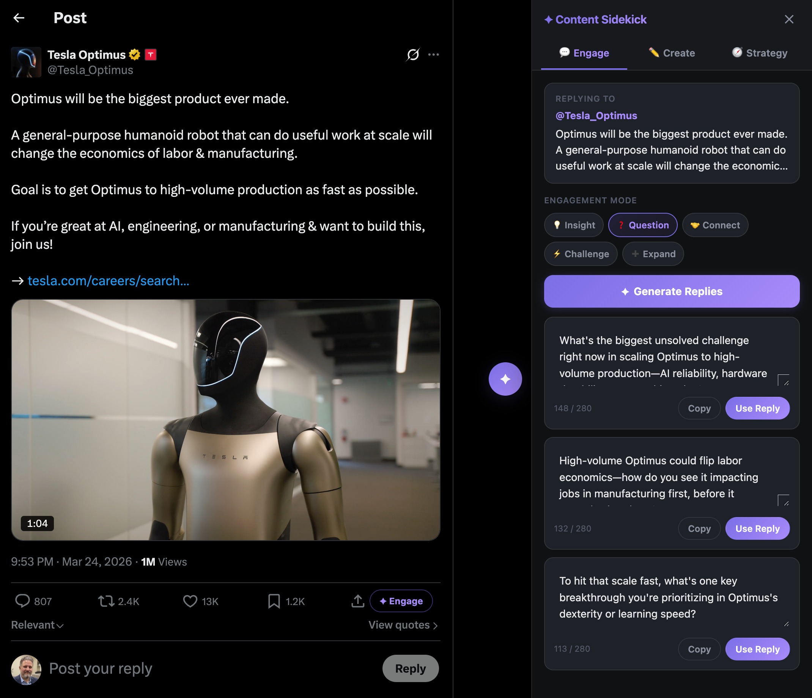
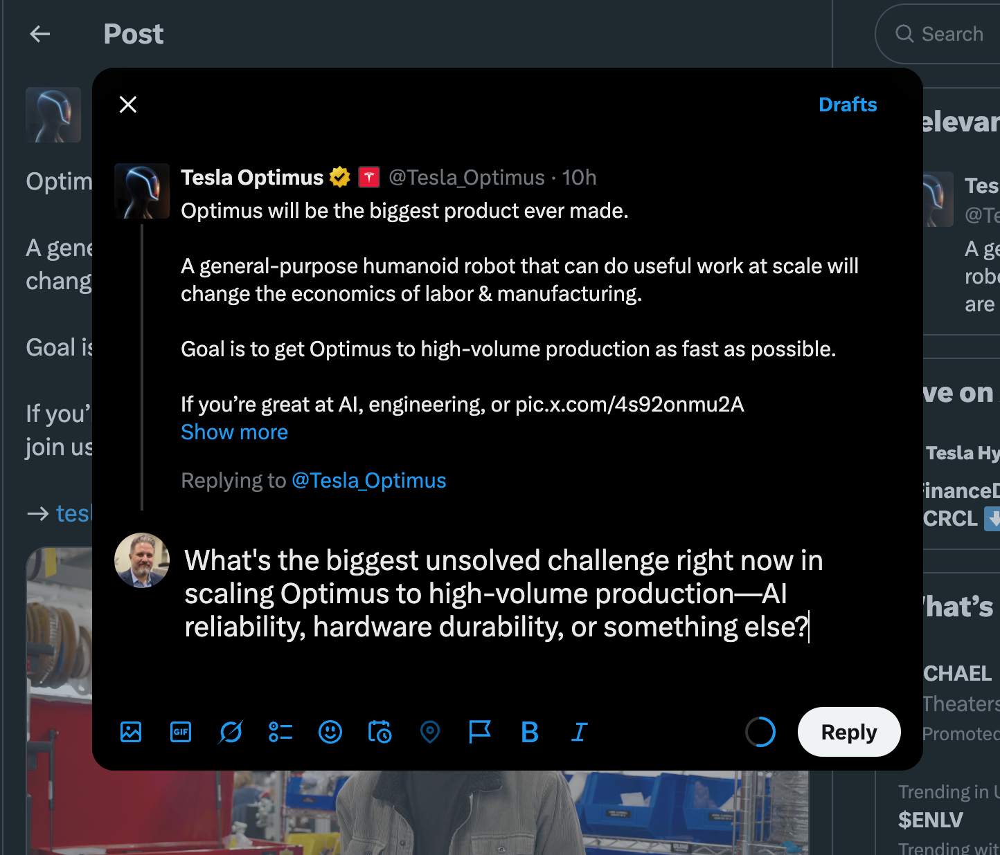
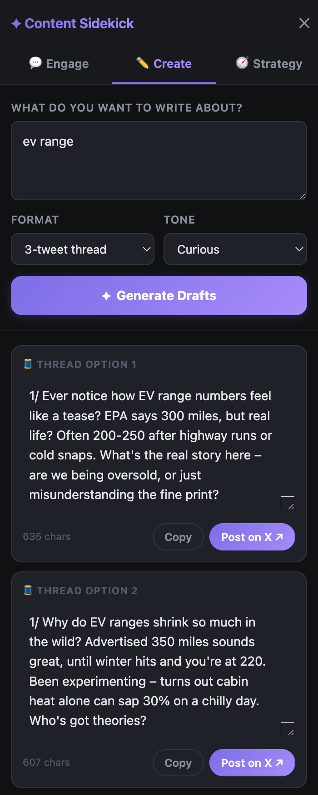
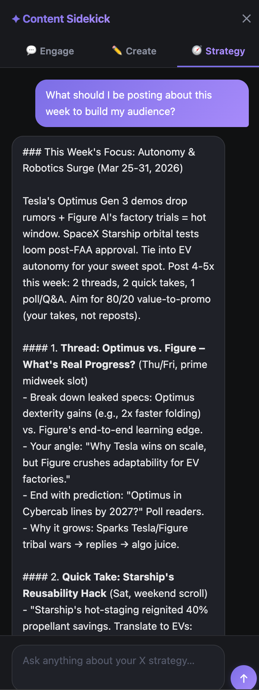

# ✦ X Content Sidekick

A Chrome extension that turns X (Twitter) into a professional brand-building platform. Powered by xAI's Grok, it gives you a persistent sidebar with three modes: intelligent reply assistance, original content creation, and conversational strategy coaching.

## Screenshots

### Settings



### Engage


### Sidebar


### Reply & Post


### Create


### Strategy


---

## Features

### 💬 Engage Tab — Smarter Replies
- One-click **✦ Engage** button appears on every tweet in your feed
- Loads the tweet into the sidebar with a choice of five engagement modes:
  - **💡 Insight** — Add a substantive angle the tweet didn't cover
  - **❓ Question** — Ask a genuine, thought-provoking question
  - **🤝 Connect** — Build rapport with the author specifically
  - **⚡ Challenge** — Respectfully push back with nuance
  - **➕ Expand** — Build on their point with a related idea
- Generates 2–5 draft replies tuned to your voice profile
- Edit drafts inline, copy, or one-click populate the X reply composer
- Refine with a custom instruction ("shorter", "add a stat", etc.)

### ✏️ Create Tab — Original Tweets & Threads
- Describe your topic, pick a format and tone
- Formats: single tweet, 3-tweet thread, 5-tweet thread, question tweet
- Tones: conversational, declarative, curious, contrarian, educational
- "Post on X ↗" copies to clipboard and opens the X composer pre-filled

### 🧭 Strategy Tab — Content Coach
- Conversational AI chat for content strategy
- Ask about weekly posting plans, hook ideas, draft feedback
- Maintains conversation history across the session
- Quick-start prompts to get going immediately

### Your Voice Profile
- Define your professional domain, voice style, and engagement goal
- Optional voice notes ("I prefer questions over declarations")
- Everything flows into every AI prompt — replies and tweets sound like you

### Other
- Persistent sidebar with smooth slide-in animation (doesn't disrupt X layout)
- Thread context awareness when viewing tweet detail pages
- Bulk-delete all replies on your profile replies tab
- Image analysis (Vision) for tweets with photos (toggle in settings)

---

## Prerequisites

- Google Chrome (or any Chromium browser)
- xAI API key from [console.x.ai](https://console.x.ai)

---

## Installation

### Step 1: Get your xAI API key
1. Visit [console.x.ai](https://console.x.ai)
2. Log in and go to **API Keys**
3. Create a new key (starts with `xai-`)

### Step 2: Load the extension
1. Go to `chrome://extensions/` in Chrome
2. Enable **Developer mode** (top-right toggle)
3. Click **Load unpacked**
4. Select the `x-content-sidekick` folder

### Step 3: Configure
1. Click the extension icon → **X Content Sidekick**
2. Enter your xAI API key
3. Fill in your **Voice Profile**:
   - Your name/handle (optional)
   - Professional domain (e.g. "B2B SaaS, AI, product")
   - Voice style and engagement goal
   - Any voice notes about how you write
4. Click **Save Settings**

---

## Usage

### Engaging on a tweet
1. Browse your X timeline
2. Click **✦ Engage** on any tweet → sidebar opens
3. Pick an engagement mode
4. Click **Generate Replies**
5. Edit inline → **Use Reply** (auto-fills composer) or **Copy**

### Creating original content
1. Open the sidebar (✦ button, right side of screen)
2. Go to the **Create** tab
3. Describe your topic, pick format + tone
4. Click **Generate Drafts**
5. Hit **Post on X ↗** — copies to clipboard and opens the composer

### Strategy chat
1. Open **Strategy** tab
2. Ask anything — "what should I post about this week?", "how do I make this hook better?"
3. The AI knows your domain and goals from your voice profile

---

## Settings

| Setting | Description |
|---|---|
| xAI API Key | Required. Get from console.x.ai |
| Drafts per request | 2–5 options generated at once |
| Image analysis | Use vision model for tweets with photos |
| Voice Profile | Name, domain, style, goal, voice notes |

---

## Troubleshooting

**✦ Engage button not appearing**
- Refresh the X page
- Ensure the extension is enabled in `chrome://extensions/`

**"Extension context lost — please refresh"**
- The extension was reloaded while the tab was open
- Just refresh the X tab and it reconnects

**API errors**
- Check your API key is valid and has credits at [console.x.ai](https://console.x.ai)
- Open the extension's service worker console in `chrome://extensions/` (click "Service Worker") to see the full error

**Sidebar not appearing**
- Look for the ✦ button on the right edge of the screen (vertically centered)
- If X's layout shifted it, try zooming out slightly

---

## File Structure

```
x-content-sidekick/
├── manifest.json       # Extension config (v2.0.0, MV3)
├── content.js          # Sidebar, per-tweet buttons, all UI logic
├── background.js       # xAI API calls, prompts, message handlers
├── popup.html          # Settings page
├── popup.js            # Settings save/load
├── styles.css          # Sidebar and all UI styles
├── docs/               # Interface screenshots
└── icons/              # Extension icons
```

---

## Privacy & Security

- API key stored locally in Chrome's sync storage — never transmitted elsewhere
- All API calls go directly from your browser to xAI's API
- No data collection, no intermediary servers
- All code is local and auditable

---

## Tips

1. **Fill in your voice profile first** — it's what makes replies sound like you vs. generic AI
2. **Use Question mode often** — questions drive more replies and engagement than statements
3. **Edit before posting** — drafts are starting points, your edit makes them authentic
4. **Thread context works on detail pages** — click into a tweet first for context-aware replies on threads
5. **Strategy tab is underrated** — ask it to critique a draft or plan your week

---

*Made for professionals who want to build genuine authority on X, not just noise.*
